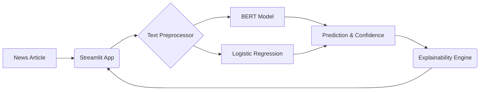

# 🕵️‍♂️ AI Fake News Detector


An intelligent application to combat misinformation by classifying news articles as Real or Fake, offering both state-of-the-art Transformer models and classical Machine Learning approaches.

## ✨ Features
- **Dual-Model Architecture:** Compare predictions between a DistilBERT Transformer and a classic TF-IDF + Logistic Regression model.
- **Explainability:** Provides confidence scores and heuristic explanations for predictions based on text length and sensationalist keyword tracking.
- **Robust NLP Pipeline:** Includes automated text cleaning (stopword removal, punctuation stripping, HTML tag removal) using NLTK.
- **Interactive UI:** Clean, responsive web interface built with Streamlit for real-time article analysis.

## 🏗️ Architecture


## 🚀 Installation & Usage

1. **Clone the repository:**
   ```bash
   git clone https://github.com/yourusername/fake-news-detector.git
   cd fake-news-detector
   ```

2. **Create a virtual environment:**
   ```bash
   python -m venv venv
   source venv/bin/activate  # On Windows use `venv\Scripts\activate`
   ```

3. **Install dependencies:**
   ```bash
   pip install -r requirements.txt
   ```

4. **Run the application:**
   ```bash
   streamlit run app.py
   ```
   *(Note: The classical model will automatically train on dummy data upon the first startup).*

## 📊 Results / Demo
*(Include screenshots of your running application here)*
- Example of a real news classification.
- Example of a fake news classification with the explainability module highlighting sensationalist words.

## 🛠️ Tech Stack
- **Framework:** PyTorch, Scikit-Learn
- **NLP:** Hugging Face Transformers, NLTK
- **Frontend:** Streamlit
- **Data Manipulation:** Pandas, NumPy
